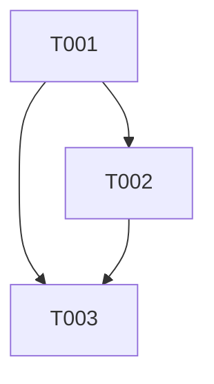

# 任務：修正遊戲結束對話框中顯示錯誤的球員名稱

**功能分支**: `004-fix-gameover-name`
**規格書**: [spec.md](spec.md)

## 第一階段：設定 (Setup)
*此功能無需設定任務。*

## 第二階段：基礎 (Foundational)
*無需基礎任務。變更特定於使用者故事。*

## 第三階段：使用者故事 1 - 顯示正確的獲勝者名稱 (P1)

**目標**: 確保遊戲結束對話框顯示獲勝者的實際名稱。
**獨立測試**: 使用自訂名稱進行遊戲，並驗證對話框中顯示獲勝者名稱。

- [x] T001 [US1] 更新 `IPongGameEngine.cs` 中的 `GameEndedEventArgs` 以包含 `WinnerName` 屬性
    - 檔案: `src/TennisScoring.WinForms/Engine/IPongGameEngine.cs`
    - 動作: 新增 `public string WinnerName { get; }` 並更新建構函式。

- [x] T002 [US1] 更新 `PongEngine.cs` 以在遊戲結束時填入 `WinnerName`
    - 檔案: `src/TennisScoring.WinForms/Engine/PongEngine.cs`
    - 動作: 在 `HandleScore` 中，從 `PlayerA` 或 `PlayerB` 取得獲勝者名稱並傳遞給 `GameEndedEventArgs`。

- [x] T003 [US1] 更新 `GameForm.cs` 以在遊戲結束對話框中顯示 `WinnerName`
    - 檔案: `src/TennisScoring.WinForms/Forms/GameForm.cs`
    - 動作: 在 `GameEngine_GameEnded` 中，於 `MessageBox.Show` 呼叫中使用 `e.WinnerName`。

## 第四階段：潤飾與橫切關注點 (Polish & Cross-Cutting Concerns)
- [x] T004 [Refinement] 更新遊戲結束對話框訊息為 "Winner is {player name}"
    - 檔案: `src/TennisScoring.WinForms/Forms/GameForm.cs`
    - 動作: 修改 MessageBox 文字格式，移除舊的訊息，僅顯示 "Winner is {WinnerName}"。

## 相依性 (Dependencies)

## 實作策略 (Implementation Strategy)
- **原子提交 (Atomic Commits)**: 依據憲法第四條，每完成一個任務 (T001, T002, T003) 後必須立即提交變更。
- **驗證**: 雖然 T001 可能會暫時破壞建構（因為介面變更），但 T002 將會修復它。請依序執行。
- **精細策略**:
    - T001: 更新 EventArgs 定義。（建構失敗）-> 提交
    - T002: 更新引擎以修復建構並實作邏輯。（建構通過）-> 提交
    - T003: 更新 UI 以使用新屬性。（建構通過）-> 提交
